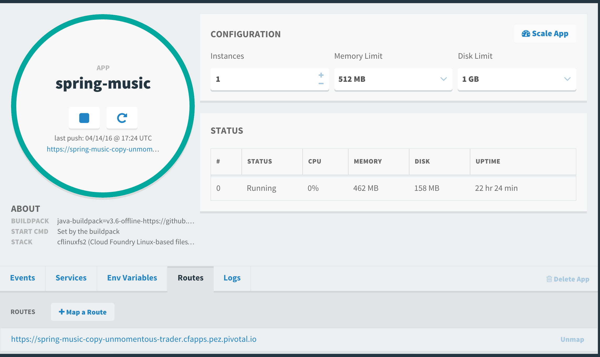

= Lab 3 - Operating your Application

[abstract]
--
Pivotal Cloudfoundry makes the work of performing operations actions, such as scaling, doing a zero-downtime deploy, and managing application health very easy.
In the next two labs we'll explore Pivotal Cloudfoundry operations.
--

== Scale the Application Up

. Now let's increase the number of running application instances to 3.  For this lab you can use the Java, Ruby, or Node.js sample app.  In each of the commands below replace _spring-music_ with the name of your deployed application:
+
----
$ cf scale -i 3 spring-music
Scaling app spring-music-copy in org pivot-awepler / space development as awepler@pivotal.io...
OK
----
+
In reporting `OK`, the CLI is letting you know that the additional requested instances have been started, but they are not yet necessarily running.

. We can determine how many instances are actually running like this:
+
====
----
$ cf app spring-music
Showing health and status for app spring-music in org pivot-awepler / space development as awepler@pivotal.io...
OK

requested state: started
instances: 3/3
usage: 512M x 3 instances
urls: spring-music-unmomentous-trader.cfapps.pez.pivotal.io
last uploaded: Thu Apr 14 17:24:17 UTC 2016

     state      since                    cpu    memory           disk   
#0   running    2016-04-14 12:20:35 PM   0.1%   461M of 512M     158.4M of 1G   
#1   starting   2016-04-15 10:29:19 AM   0.0%   692K of 512M     1.3M of 1G   
#2   starting   2016-04-15 10:29:19 AM   0.0%   226.3M of 512M   158.4M of 1G   
----
<1> This application instance has completed the startup process and is actually able to accept requests.
<2> This application instance is still starting and will not have any requests routed to it.
====

. Eventually all instances will converge to a running state:
+
----
$ cf app spring-music
Showing health and status for app spring-music in org pivot-awepler / space development as awepler@pivotal.io...
OK

requested state: started
instances: 3/3
usage: 512M x 3 instances
urls: spring-music-unmomentous-trader.cfapps.pez.pivotal.io
last uploaded: Thu Apr 14 17:24:17 UTC 2016

     state     since                    cpu    memory           disk   
#0   running   2016-04-14 12:20:35 PM   0.1%   461M of 512M     158.4M of 1G   
#1   running   2016-04-15 02:55:16 AM   0.1%   503.2M of 512M   158.4M of 1G   
#2   running   2016-04-15 10:24:37 AM   0.2%   418.1M of 512M   158.4M of 1G   
----

== Scale the Application Down

. We can scale the application instances back down as easily as we scaled them up, using the same command structure:
+
----
$ cf scale -i 1 spring-music
Scaling app spring-music in org pivot-awepler / space development as awepler@pivotal.io...
OK
----

. Check the application status again:
+
----
$ cf app spring-music
Showing health and status for app spring-music in org pivot-awepler / space development as awepler@pivotal.io...
OK

requested state: started
instances: 1/1
usage: 512M x 1 instances
urls: spring-music-copy-unmomentous-trader.cfapps.pez.pivotal.io
last uploaded: Thu Apr 14 17:24:17 UTC 2016

     state     since                    cpu    memory           disk   
#0   running   2016-04-14 12:20:35 PM   0.1%   461.9M of 512M   158.4M of 1G 
----

== HTTP Routing

There are two ways to discover what routes, or HTTP URLs, are mapped to an application
The first is available via the CLI. Just type:

----
$ cf app spring-music
Showing health and status for app spring-music in org pivot-awepler / space development as awepler@pivotal.io...
OK

requested state: started
instances: 1/1
usage: 512M x 1 instances
urls: spring-music-copy-unmomentous-trader.cfapps.pez.pivotal.io
last uploaded: Thu Apr 14 17:24:17 UTC 2016

     state     since                    cpu    memory           disk   
#0   running   2016-04-14 12:20:35 PM   0.1%   461.9M of 512M   158.4M of 1G  
----

and you'll see the list of routes in the section that says _urls_.

The second way is via the Apps Manager UI.  Click on the _Spring-Music_ application to view application details.  Select the _Routes_ tab to view a list of mapped routes:

. We can easily add an additional route by clicking on _+ Map a Route_ and supplying the new hostname:
+
image::lab3.png[]

. Navigate to the new URL in your browser window.  You should see that same application displayed!
+
image::lab4.png[]

. We can just as easily remove a route by clicking on _Unmap_ on the route you wish to remove.
+
image::lab5.png[]
+
If you navigate to that URL you'll receive a HTTP 404 response
+
image::lab6.png[]

. This is how blue-green deployments are accomplished.
+
image::blue-green.png[]

== Accessing Container Contents

. The contents of a deployed application container may be retrieved using the _files_ command within the CLI.  If the path supplied to the command represents a folder, the contents of the folder are retreived:
+
====
----
$ cf files workshop
Getting files for app workshop in org TELCO / space gammon as jtgammon@pivotal.io...
OK

.bash_logout                              220B
.bashrc                                   3.6K
.profile                                  675B
app/                                         -
logs/                                        -
run.pid                                     3B
staging_info.yml                          1.1K
tmp/

$ cf files workshop app/    <1>
Getting files for app workshop in org TELCO / space gammon as jtgammon@pivotal.io...
OK

.java-buildpack/                             -
.java-buildpack.log                     136.6K
META-INF/                                    -
WEB-INF/                                     -
resources/                                   -                                         -
----
<1> The actual binaries of the application can be found in the /app folder
====
. We can also retrieve the contents of a file using the same command if the path supplied is a path to a file:
+
----
$ cf files workshop staging_info.yml
Getting files for app workshop in org TELCO / space gammon as jtgammon@pivotal.io...
OK

---
buildpack_path: /var/vcap/data/dea_next/admin_buildpacks/920c5763-8b8e-4ea3-b903-c7b8b78947c5_a300c3fca530dc16345dbd6feb26b13897d05265
detected_buildpack: java-buildpack=v3.0-offline-https://github.com/cloudfoundry/java-buildpack.git#3bd15e1
  open-jdk-jre=1.8.0_40 spring-auto-reconfiguration=1.7.0_RELEASE tomcat-access-logging-support=2.4.0_RELEASE
  tomcat-instance=8.0.21 tomcat-lifecycle-support=2.4.0_REL...
start_command: JAVA_HOME=$PWD/.java-buildpack/open_jdk_jre JAVA_OPTS="-Djava.io.tmpdir=$TMPDIR
  -XX:OnOutOfMemoryError=$PWD/.java-buildpack/open_jdk_jre/bin/killjava.sh -Xmx382293K
  -Xms382293K -XX:MaxMetaspaceSize=64M -XX:MetaspaceSize=64M -Xss995K -Daccess.logging.enabled=false
  -Dhttp.port=$PORT" $PWD/.java-buildpack/tomcat/bin/catalina.sh run
effective_procfile:
  web: JAVA_HOME=$PWD/.java-buildpack/open_jdk_jre JAVA_OPTS="-Djava.io.tmpdir=$TMPDIR
    -XX:OnOutOfMemoryError=$PWD/.java-buildpack/open_jdk_jre/bin/killjava.sh -Xmx382293K
    -Xms382293K -XX:MaxMetaspaceSize=64M -XX:MetaspaceSize=64M -Xss995K -Daccess.logging.enabled=false
    -Dhttp.port=$PORT" $PWD/.java-buildpack/tomcat/bin/catalina.sh run
----
